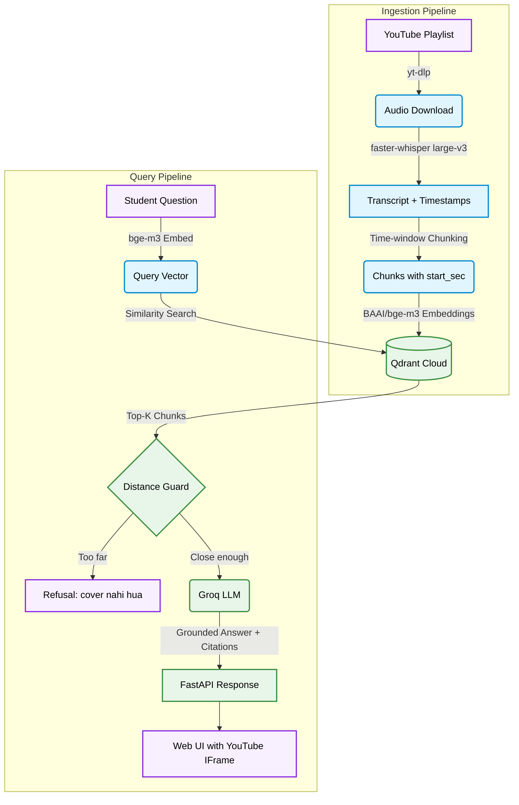

<div align="center">

#  YoutubeScrapper — Timestamp-Level RAG over DSA Lectures

**Ask any DSA question in Hinglish or English and get an answer plus a clickable link that jumps to the exact second it was explained in the lecture**

[](https://www.python.org/)
[](https://fastapi.tiangolo.com/)
[](https://groq.com/)
[](https://qdrant.tech/)
[](https://github.com/openai/whisper)

</div>

---

##  Overview

A Retrieval-Augmented Generation system built over any number of YouTube playlists. A student asks a question across selected playlists — the system finds the exact moment in the exact lecture where it was explained, and returns a grounded answer with a clickable timestamp link that seeks the embedded player to that second.

Every generic RAG demo returns a blob of text. This returns *a place in a video*.

---

###  RAG Architecture



##  Features

| | |
|---|---|
|  **Timestamp-Level Retrieval** | Citations link to the exact second in the exact lecture — clicking `[2]` seeks the embedded player in-page |
|  **Grounded Answers Only** | Three guards prevent hallucination: distance cutoff, model self-refusal, and citation-presence check |
|  **Hinglish + English** | `BAAI/bge-m3` handles code-switched queries natively |
|  **Batched Transcription** | `faster-whisper` with batch=8 achieves 8x realtime on a GPU — 3x faster than sequential |
|  **Fully Resumable** | Cached transcripts + idempotent upserts mean re-runs skip all completed work |
|  **Fault-Tolerant Ingest** | One failing video logs and continues; network retries with exponential backoff |
|  **Web UI** | Single-page FastAPI app using the YouTube IFrame API for in-page seeks |
|  **Evaluation Suite** | Golden-set hit-rate evaluation against hand-written retrieval test cases |

---

##  Tech Stack

| Component | Technology |
|---|---|
| Playlist + Audio | `yt-dlp` (Python API) |
| Transcription | `faster-whisper` — `large-v3`, batched, CUDA |
| Chunking | Custom time-window chunker (timestamps preserved) |
| Embeddings | `sentence-transformers` + `BAAI/bge-m3` (1024-dim) |
| Vector Store | Qdrant Cloud |
| LLM | Groq — `openai/gpt-oss-120b` |
| API + UI | `FastAPI` + single HTML page with YouTube IFrame API |
| CLI | `typer` + `rich` |
| Dependency Management | `uv` |

---

##  Project Structure

```
YoutubeScrapper/
├── ytrag/
│   ├── config.py        # All tunables, env-driven
│   ├── playlist.py      # Playlist listing + audio download
│   ├── transcribe.py    # Audio → Segment[], cached to JSON
│   ├── chunk.py         # Segment[] → Chunk[] (time windows)
│   ├── embed.py         # Pluggable embedder
│   ├── index.py         # Qdrant upsert + query
│   ├── answer.py        # Retrieve → grounded answer + citations
│   ├── evaluate.py      # Golden-set retrieval hit rate
│   └── cli.py           # typer entrypoint
├── api/
│   ├── main.py          # FastAPI app
│   └── static/
│       └── index.html   # Web UI (YouTube IFrame API)
├── eval/
│   └── golden.json      # Hand-written retrieval test cases
├── transcripts/          # Cached transcripts (committed — ~6 MB)
└── README.md
```

Runtime data lives outside the repo in `~/.ytrag/`:

```
~/.ytrag/
├── audio/      # <video_id>.m4a — DELETABLE, regenerable
└── transcripts/ # <video_id>.json — PRECIOUS, hours of GPU time
```

---

##  Setup and Installation

### Prerequisites

- Python 3.11
- A [Groq API key](https://console.groq.com/keys) (free)
- A [Qdrant Cloud](https://cloud.qdrant.io/) cluster (free tier)
- GPU recommended for transcription (falls back to CPU automatically)
- [`uv`](https://docs.astral.sh/uv/) installed

### 1. Clone the repository

```bash
git clone https://github.com/Shashank17singh/YoutubeScrapper.git
cd YoutubeScrapper
```

### 2. Install dependencies

```bash
uv sync
# GPU support for transcription (optional but recommended):
uv sync --extra cuda
```

### 3. Set your API keys

```bash
cp .env.example .env
# Edit .env and fill in:
# GROQ_API_KEY=...
# QDRANT_URL=...
# QDRANT_API_KEY=...
```

### 4. Load the prebuilt index (quickest start)

Transcripts are already committed to the repo. Skip the GPU-heavy ingest step entirely:

```bash
uv run ytrag load
```

This reads the committed transcripts and builds a local vector index in ~20 seconds.

### 5. Start the web UI

```bash
uv run ytrag serve
```

Open <http://127.0.0.1:8000>, ask a question, click a timestamp — the lecture plays from that exact second.

---

##  CLI Reference

```bash
uv run ytrag preflight --playlist "<URL>"  # check all dependencies before a long run
uv run ytrag ingest --playlist "<URL>"     # download → transcribe → chunk → index
uv run ytrag ingest --playlist "<URL>" --limit 1  # test with one video first
uv run ytrag ask "memoization kya hota hai?"       # answer + citations
uv run ytrag search "adjacency list"               # retrieval only, no LLM
uv run ytrag eval --verbose                         # hit-rate against golden set
uv run ytrag reindex                                # re-chunk + re-embed from transcripts
uv run ytrag stats
uv run ytrag serve                                  # web UI on localhost:8000
```

---

##  Configuration

All tunables are env-driven. Defaults live in [`ytrag/config.py`](ytrag/config.py).

| Variable | Default | Notes |
|---|---|---|
| `YTRAG_WHISPER_LANG` | `en` | Decide with `ytrag langtest` first |
| `YTRAG_WHISPER_MODEL` | `large-v3` | `medium` if you're impatient |
| `YTRAG_WHISPER_BATCH` | `8` | Batched inference — `0` to disable |
| `YTRAG_CHUNK_SECONDS` | `75` | ~one explained idea per chunk |
| `YTRAG_EMBED_MODEL` | `BAAI/bge-m3` | `all-MiniLM-L6-v2` for a free deploy tier |
| `YTRAG_TOP_K` | `6` | Retrieved chunks per query |
| `YTRAG_MAX_DISTANCE` | `0.5` | Grounding cutoff — tune with `ytrag eval` |
| `YTRAG_LLM_MODEL` | `openai/gpt-oss-120b` | |

---

##  Known Limitations

- Transcription requires a decent GPU for the full playlist (~8.5 hours on an RTX GPU). The committed transcripts skip this step for everyone else.
- `BAAI/bge-m3` is 2.2 GB — swap to `all-MiniLM-L6-v2` for free-tier deployment (`uv run ytrag reindex` after changing the env var).
- The local Qdrant index allows a single process — stop `ytrag serve` before running `ytrag ask` in another terminal, or point `QDRANT_URL` at a hosted cluster.
